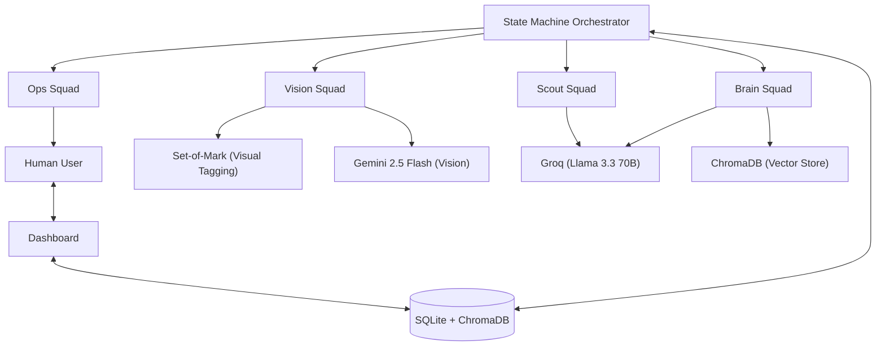

# Project Commuter Architecture

Project Commuter follows a **Swarm-based Orchestration** pattern with a robust **State Machine** at its core.

## 🏗 System Overview

## 🐜 Agent Squads

### 1. Scout Squad
- **JobSearchAgent**: Generates search URLs.
- **ListingParserAgent**: Extracts structured data from listing pages.

### 2. Vision Squad
- **VisionAgent**: Analyzes screenshots with **Set-of-Mark (SoM)** ID tags to identify interactive elements.
- **NavigationAgent**: Executes clicks, typing, and scrolling based on vision decisions.

### 3. Brain Squad
- **MemoryAgent**: Searches historical answers in ChromaDB.
- **ContextAgent**: Performs RAG against CV/GitHub context.
- **DecisionAgent**: Merges memory and context to provide final form inputs.

### 4. Ops Squad
- **SOSAgent**: Triggers intervention state for CAPTHCAs or unknown questions.
- **LiaisonAgent**: Interfaces with the Streamlit dashboard for real-time human feedback.

## 🧪 Stealth & Reliability
- **Profile Cloning**: Isolates the main Chrome profile into a temporary instance to avoid Singleton locks.
- **Biometric Simulation**: Randomized typing patterns and mouse "flight" curves.
- **Error Recovery**: Automatic retries and human-in-the-loop fallback.
