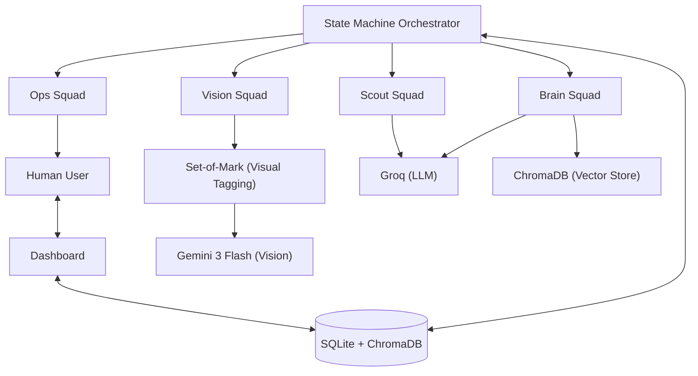

# Project Commuter Architecture

Project Commuter follows a **Swarm-based Orchestration** pattern with a robust **State Machine** at its core. This document breaks down the v2.0 architecture designed for high-fidelity automation and undetectable browser interaction.

## 🏗 System Overview

## 🐜 The 1-Agent-1-Tool Swarm

### 1. Scout Squad (Discovery)
- **JobSearchAgent**: Constructs search URLs based on intent.
- **ListingParserAgent**: Parses HTML chunks into structured JSON using Groq.

### 2. Vision Squad (Interaction)
- **VisionAgent**: The "Eyes." Uses **Set-of-Mark (SoM)** visual tagging to label elements before analysis by Gemini Flash. Returns SoM IDs.
- **NavigationAgent**: The "Hands." Decides actions (click/type) based on SoM IDs, eliminating CSS selector brittleness.

### 3. Brain Squad (Context Engine)
This is the core semantic layer.
- **MemoryAgent**: Semantic search against previous answers using **ChromaDB**.
- **ContextAgent**: Performs RAG against the user's CV and GitHub summary stored in the vector store.
- **DecisionAgent**: The final arbiter. Compares Memory and Context results to decide the final input or trigger SOS.

### 4. Ops Squad (Fail-Safe)
- **SOSAgent**: Triggers mobile alerts when human intervention is required.
- **LiaisonAgent**: Interfaces with the Streamlit dashboard for user overrides.

## 🧠 State Machine Orchestrator
The `main.py` orchestrator implements a formal state machine:
- **SCOUTING**: Finding new jobs.
- **NAVIGATING**: Moving to the application page.
- **APPLYING**: The core loop using SoM Vision and the Brain Squad.
- **SOS**: Paused state waiting for user input.
- **IDLE**: Scheduled downtime to simulate human sleep cycles.

## 🕵️ Stealth Protocols 
- **Dynamic Fingerprinting**: Mirrors the host machine's platform, OS, and Python versions in the User-Agent.
- **Advanced Masking**: Spoofs WebGL vendor/renderer and AudioContext fingerprints to blend in with standard Windows/Chrome profiles.
- **Playwright-Stealth**: Core patches to avoid basic bot detection.
