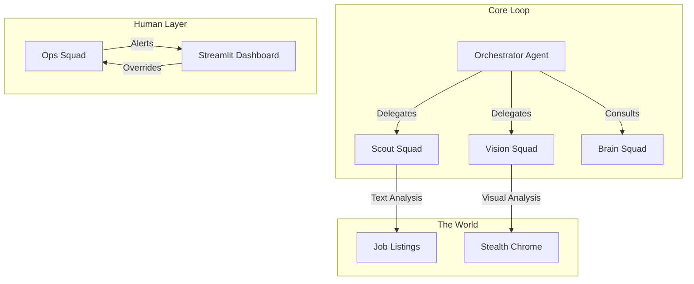

# 🏗️ System Architecture

Project Commuter represents a shift from "scripted automation" to **"cognitive agency"**. Instead of hardcoding XPaths (which break weekly), we give the agent **Vision** and **Judgment**.

## 🧩 The Squad Pattern

The system is organized into specialized "Squads" to separate concerns and maximize reliability.

### 1. The Orchestrator (The COO)

* **Role**: High-level state machine.
* **Responsibility**: It manages the lifecycle. It decides *when* to search, *when* to apply, and *when* to sleep to mimic human circadian rhythms. It never interacts with the browser directly; it delegates.

### 2. The Vision Squad (The Eyes & Hands)

* **Vision Agent (Gemini 2.5 Flash)**:
* Receives a screenshot annotated with **Set-of-Mark (SoM)** tags.
* Outputs strictly structured JSON instructions (e.g., `{"action": "click", "id": 12}`).
* *Why Gemini?* It has superior OCR and spatial reasoning capabilities compared to pure text models.

* **Navigation Agent (Groq/Llama 4)**:
* The "Hands" of the operation. It executes the biometrically smoothed mouse movements and typing.

### 3. The Brain Squad (The Memory)

* **Context Engine**:
* Instead of guessing answers, the Brain Squad retrieves chunks of text from your uploaded CV.

* **Vector Search**: Matches application questions ("Do you have experience with CI/CD?") to relevant bullet points in your resume.

### 4. The Ops Squad (Reliability)

* **SOS Protocol**:
* If the Vision Agent sees a CAPTCHA or the Brain Agent has low confidence (<50%), the Ops Squad triggers an **SOS**.
* The system pauses, alerts the Dashboard, and waits for human input. This "Human-in-the-Loop" design ensures the bot never makes fatal mistakes.

## 🛡️ Stealth Engineering

We employ a "Defense-in-Depth" strategy against bot detection:

1. **Persistent Bot Identity**: Instead of cloning your personal profile (which causes file lock issues), the bot maintains a **dedicated, encrypted Chrome profile** (`data/chrome_bot_profile`). You log in once, and the bot persists that session forever, keeping your personal browsing data completely separate and safe.
2. **Fingerprint Consistency**: We do not block ads or trackers blindly, as this is a bot signal. Instead, we match the fingerprint of a standard Windows 10/11 Home user.
3. **Biometric Mimicry**:
* **Typing**: Variable latency between keystrokes. Mistakes are made and backspaced.
* **Mouse**: Movement follows Bezier curves with "overshoot" correction, simulating hand-eye coordination.

## 📉 Cost Optimization

The system is architected to run **100% Free**.

* **High Volume Logic**: Handled by **Groq (Llama 3.1 8B / 4 Scout)** (500k req/day limit).
* **Visual Logic**: Handled by **Gemini 2.5 Flash** (20-50 req/day limit).
* **Fallback Swarm**: If `Flash` hits a rate limit, the bridge automatically downgrades to `Flash-Lite` or upgrades to `Gemini 3` seamlessly.
