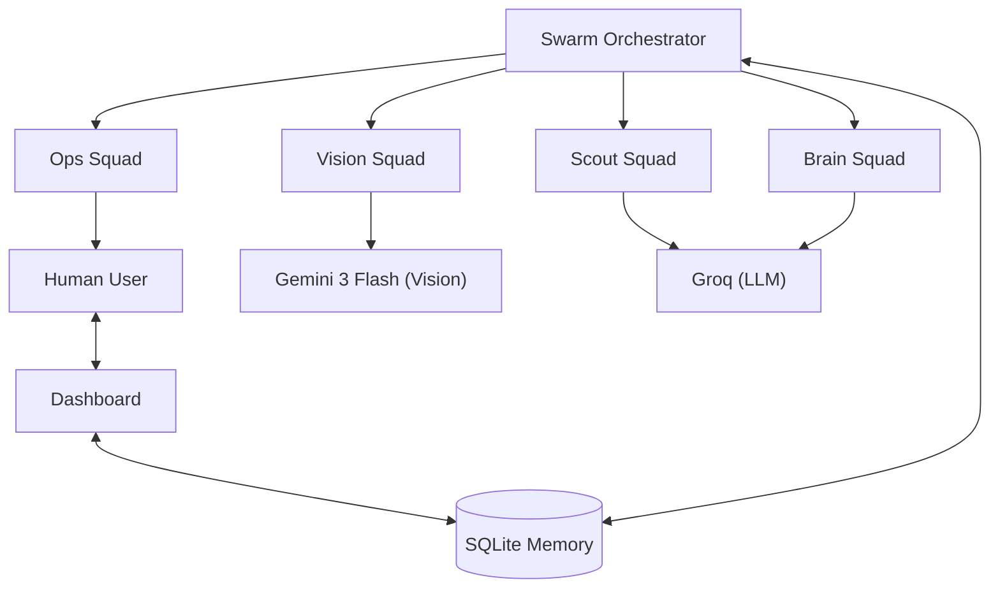

# Project Commuter Architecture

Project Commuter follows a **Swarm-based Orchestration** pattern inspired by the "1 Agent 1 Tool" philosophy. This document breaks down how the agents interact and maintain a "Zero Failure" mandate.

## 🏗 System Overview

## 🐜 The 1-Agent-1-Tool Swarm

To avoid complexity and maximize reliability, every agent in the swarm is restricted to a single primary capability.

### 1. Scout Squad (Discovery)
- **JobSearchAgent**: Constructs search URLs based on intent.
- **ListingParserAgent**: Parses HTML chunks into structured JSON.
- **SkepticAgent**: Conducts company "Background Checks" via Google Search tools.

### 2. Vision Squad (Interaction)
- **VisionAgent**: The "Eyes." Converts screenshots into structured UI maps using Gemini Flash.
- **NavigationAgent**: The "Hands." Decides where to click or type based on the UI map.
- **ScrollAgent**: Manages reading behavior and page pagination.

### 3. Brain Squad (Context Engine)
This is the core anti-hallucination layer.
- **MemoryAgent**: Fuzzy-matches against previous answers in the SQLite `answer_bank`.
- **ContextAgent**: Performs RAG (Retrieval-Augmented Generation) against the user's encoded CV and GitHub summary.
- **DecisionAgent**: The final arbiter. If neither Memory nor Context can provide a >90% confidence answer, it defaults to the SOS protocol.

### 4. Ops Squad (Fail-Safe)
- **SOSAgent**: Triggers mobile alerts and pauses the swarm.
- **LiaisonAgent**: Polls for user feedback from the dashboard.

## 🧠 Anti-Hallucination Protocol

When the bot encounters a question like *"Do you have experience with Redis?"*:

1. **Memory Level**: Check if the user has answered this *exact* question before.
2. **Context Level**: Scan GitHub repos and CV. If the user has a repo named "redis-caching-layer", the bot can deduce "Yes."
3. **SOS Level**: If the bot finds zero evidence, it **MUST** pause. No guessing allowed.

## 🕵️ Stealth Protocols

- **Resident IP**: Runs locally, matching the user's usual login patterns.
- **Playwright-Stealth**: Patches `navigator.webdriver` and masks browser fingerprints.
- **Bezier Movement**: Mouse movements follow randomized arcs, not straight lines.
- **Coffee Break Algorithm**: Randomized pauses after batch applications to simulate human fatigue.
