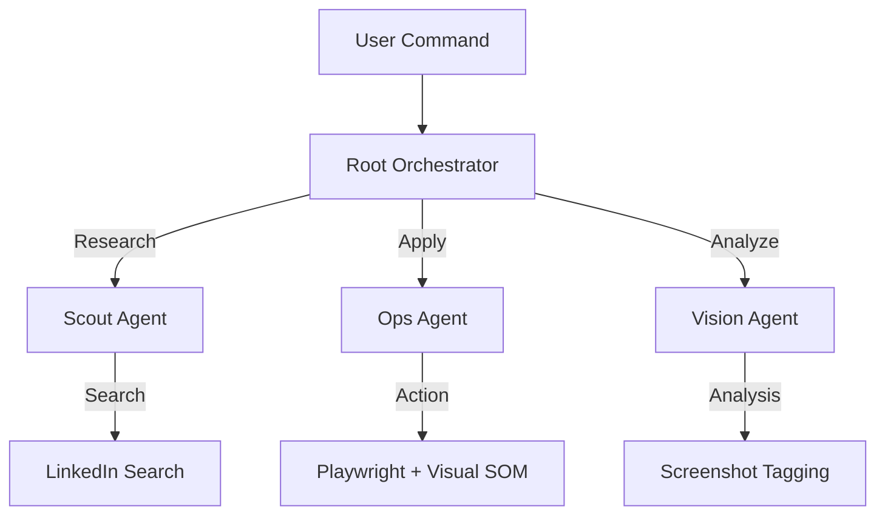

# Project Commuter

[](https://python.org)
[](https://playwright.dev)
[](https://groq.com)
[](LICENSE)

**Project Commuter** is a specialized, autonomous agent designed for one specific mission: **High-Precision LinkedIn Easy Apply**.

Unlike generic bots that "spray and pray," Commuter acts as a **Sniper**. It uses **Visual Set-of-Mark (SOM)** technology to "see" the screen exactly as a human does, identifying buttons by ID rather than guessing coordinates. It reads your PDF CV, builds a mental model of your career, and applies intelligently.

---

## ⚡ Key Capabilities

### 🧠 **Context Injection Engine**
No more filling out JSON config files.
* **Drag & Drop:** Upload your PDF CV directly to the dashboard.
* **Instant Parsing:** The Llama-8B model extracts your skills, experience, and bio in milliseconds.
* **Adaptive Memory:** The agent uses this context to answer application questions dynamically.

### 👁️ **Visual Set-of-Mark (SOM)**
The "Secret Sauce" behind our reliability.
* **No Blind Clicks:** The agent doesn't guess X/Y coordinates.
* **Semantic Vision:** It draws **Green ID Boxes** on every interactive element (buttons, inputs).
* **Precision:** It commands the browser: *"Click ID #42 (Submit Button)"*—eliminating "missed click" errors common in other bots.

### 🛡️ **Stealth Architecture**
Built to survive in the wild.
* **Fingerprint Masking:** Uses `playwright-stealth` to mimic human browser headers.
* **LinkedIn-Only Scope:** Hardcoded restrictions prevent the bot from wandering into "honeypot" sites.
* **Human-in-the-Loop:** A "Take Control" intervention mode allows you to handle CAPTCHAs manually without killing the session.

---

## 🚀 Quick Start

### Prerequisites
* `GROQ_API_KEY` (Required for the AI Brain)
* Python 3.10+

### 1. Installation
```bash
git clone https://github.com/nwokike/project-commuter.git
cd project-commuter
pip install -r requirements.txt
playwright install chromium

```

### 2. Launch the Neural Core

```bash
python server.py

```

> The dashboard will go live at `http://localhost:5000`

### 3. Workflow

1. **Upload CV:** Click the **📄 Upload CV** button in the header.
2. **Authenticate:** Manually log in to LinkedIn in the **Live Target** browser window.
3. **Command:** Type your objective into the chat:
> *"Apply to Senior Python Developer jobs in London (Remote)."*


---

## 🏗️ Architecture

The system follows a strict **Hierarchical Agent Pattern**:



* **Root Agent:** The Strategist. Manages the session and delegates tasks.
* **Scout Agent:** The Hunter. specialized in finding high-quality listings.
* **Ops Agent:** The Executor. Handles the "Easy Apply" modal flow.
* **Vision Agent:** The Observer. Detects login screens and success states.

---

## ⚠️ Disclaimer

**Educational Use Only.**
This software is designed for research into autonomous web agents. Using automated tools on LinkedIn violates their Terms of Service. The authors are not responsible for account suspensions or bans. **Use at your own risk.**

---

## 🤝 Contributing

We value **Quality over Quantity**. Please read `CONTRIBUTING.md` before submitting PRs.
